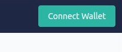

Повторное делегирование означает перемещение некоторых или всех застейканых монет, которые вы делегировали одному валидатором, к другому.

!!! обратите внимание
    Для повторного делегирования не следует вручную анстейкать монеты с одного валидатора и стейкать другому. Это вызовет период разблокировки, в результате чего вы не сможете получать вознаграждение за стейкинг в течение 21 дня, пока вы будете ждать окончания периода разблокировки. Повторное делегирование, в отличие от ручного анстейкинга и стейкинга, представляет собой мгновенный процесс перемещения части или всех ваших застейканых FET от одного валидатора к другому.

## Зачем ределегировать

Могут быть разные причины, по которым вы решили переделегировать и перераспределить застейканых монеты. Вот несколько примеров:

* **Для повышения децентрализации и, следовательно, безопасности сети:** Чтобы сеть Fetch была максимально безопасной, не должно быть большой концентрации застейканых монет (например, более 33% делегированных FET), у небольшого числа (например, 10) валидаторов. Если вы видите, что это происходит в настоящее время и что вы также способствовали этому, делегируя свои монеты одному из этих валидаторов, вы можете рассмотреть возможность перераспределения своих монет в пользу других валидаторов.
* **Чтобы снизить риски, связанные со стейкингом:** Помните, что когда вы делегируете свои токены валидатору, вы также разделяете вознаграждение за его вклад в протокол консенсуса сети, вы также разделяете наказание, которое он получит, если будет вести себя неправильно и действовать против протокола сети. Если это произойдет, ваш стейк будет уменьшен. Чтобы уменьшить этот риск, вы можете перераспределить часть своих застейканых монет другим валидаторам, чтобы получить более широкое распределение стейка.

## Для ределигования монет

1. Перейдите на [страницу браузера ledger](https://browse-fetchhub.fetch.ai/validators).
2. Подключите свой кошелек, если он еще не подключен, нажав **Connect Wallet** в правом верхнем углу.
  
3. Нажмите на адрес вашего кошелька в правом верхнем углу страницы, чтобы перейти на панель управления staking dashboard.
4. В разделе **Delegations** нажмите на **Transfer Stake** напротив валидатора с которого вы хотите ределиговать часть или все свои монеты.
5. Во всплывающем окне выберите валидатора, которому вы хотите ределигировать свой стейк.

    !!! информация
        В выпадающем списке валидаторы расположены не по порядку. Для просмотра подробностей о валидаторах смотрите [распределение голосов валидаторов](https://explore.fetch.ai/voting-power-distribution) и [подробности о валидаторах] (https://explore.fetch.ai/validators).

6. Введите количество FET, которое вы хотите ределигировать другому валидатору и нажмите **Transfer Stake**.
7. Кошелек покажет вам сводку по транзакции. Просмотрите ее, выберите комиссию за транзакцию и, если вас все устраивает, нажмите **Approve** для завершения операции.

## Выбор валидатора

Выбор валидатора для делегирования своего стейка - это важное решение, которое в конечном итоге влияет на безопасность и производительность сети. Когда вы выбираете валидатора, вы, по сути, голосуете в сети, указывая на его благонадежность и на то, что ему выгодно участвовать в поддержании работы сети.

Когда дело доходит до выбора валидатора, вы, как делегирующий, должны провести собственное исследование и проявить должную осмотрительность, чтобы узнать о его репутации и о том, насколько хорошо он работал до сих пор. Делегирование должно быть активной ролью между вами и валидатором.

Чтобы помочь вам выбрать подходящий валидатор, вот список критериев, на которые следует обратить внимание:

* Есть ли у них веб-сайт?
* Активно ли они представлены в социальных сетях (например, Twitter, Reddit, Instagram, ...)?
* Легко ли с ними связаться (например, в Discord, Telegram, ...)?
* Есть ли у них FET, самостоятельно привязанный к их узлу?
* Активны ли они в сообществе?
* Имеют ли они высокий аптайм?
* Предлагают ли они защиту от слэшинга и двойного подписывания блоков?
* Участвуют ли они в голосовании по предложениям?
* Есть ли у них миссия или набор принципов, которые совпадают с вашими?

На некоторые из этих вопросов можно получить ответы с помощью наших [Native Block Explorer](https://explore.fetch.ai/validators) или [Mintscan](https://www.mintscan.io/fetchai/validators). Для получения ответов на некоторые другие вопросы из этого списка вам придется обратиться к валидаторам, что является хорошей возможностью проверить, активны ли они или нет.
