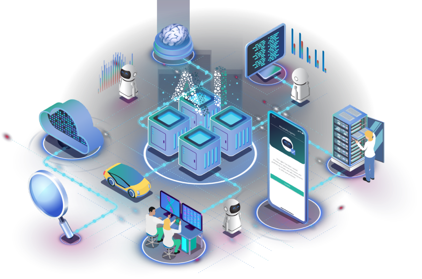

# Добро пожаловать в экосистему Fetch.ai

## Что такое Fetch.ai?

Наша миссия заключается в создании инфраструктуры, необходимой для разработки современных, децентрализованных и одноранговых (P2P) приложений, свободных от централизованного поиска ренты.

Мы добиваемся этого, предоставляя программные инструменты с открытым исходным кодом, которые вы можете использовать вместе с нашей взаимодействующей децентрализованной сетью для использования возможностей искусственного интеллекта и выполнения сложных задач в _цифровой экономике_.

## Начало работы

Экосистема fetch состоит из различных инструментов и фреймворков, которые помогут вам создать и запустить ваши собственные децентрализованные приложения. Выберите один из них ниже, чтобы погрузиться в работу!

    

        
Инструменты для работы с пользователями

        

            <a href="https://aea-registry.fetch.ai/" target="_blank" class="diagram-item">
AEA Registry
</a>
            <a href="https://aea-manager.fetch.ai/" target="_blank"  class="diagram-item">
AEA Manager
</a>
            <a href="basics/wallet/getting_started/" class="diagram-item">
Fetch Wallet
</a>
            <a href="https://explore-fetchhub.fetch.ai/" target="_blank" class="diagram-item">
Explorer
</a>
        

    

    

        
Инструменты, использующие цепь

        

            

                <a class="item-link" href="/aea" >
                    AEA Framework
                    <a href="/aea/acn" class="diagram-item-child">
                        
ACN

                    </a>
                </a>
            

            
Upcoming Tool

        

    

    

        
Инструменты для прямого взаимодействия с цепью

        

            <a href="/CosmPy" class="diagram-item">CosmPy</a>
            
Предстоящий инструмент

        

    

    

        
Цепь

        

            

                <a class="item-link" href="/ledger_v2" >
                    Ledger
                    <a class="diagram-item-child-disabled">
                    
Cosmwasm

                    </a>
                </a>
            

        

    

Вы также можете сразу перейти к нашим репозиториям на GitHub:

- [Ledger (fetchd)](https://github.com/fetchai/fetchd)
- [CosmPy](https://github.com/fetchai/cosmpy)
- [AEA Framework (& ACN)](https://github.com/fetchai/agents-aea)
- [Fetch Wallet](https://github.com/fetchai/fetch-wallet)

## Помощь и поддержка

Если вы хотите сообщить об ошибке или запросить функцию:

- [Ledger (fetchd)](https://github.com/fetchai/fetchd/issues/new/choose)
- [Cosmpy](https://github.com/fetchai/cosmpy/issues/new/choose)
- [AEA Framework](https://github.com/fetchai/agents-aea/issues/new/choose)
- [Documentation](https://github.com/fetchai/docs/issues/new/choose)

Хотите сообщить об уязвимости в системе безопасности? Посетите наш [Bug Bounty](https://docs.fetch.ai/bug_bounty/).

## Вопросы и общие обсуждения  

Посетите форумы разработчиков fetch.ai::

- [Ledger (fetchd)](https://github.com/fetchai/fetchd/discussions)
- [CosmPy](https://github.com/fetchai/cosmpy/discussions)
- [AEA Framework](https://github.com/fetchai/agents-aea/discussions)
- [Fetch Wallet](https://github.com/fetchai/fetch-wallet/discussions)

Общайтесь с разработчиками Fetch.ai в [discord](https://bit.ly/3ra5uMI).
